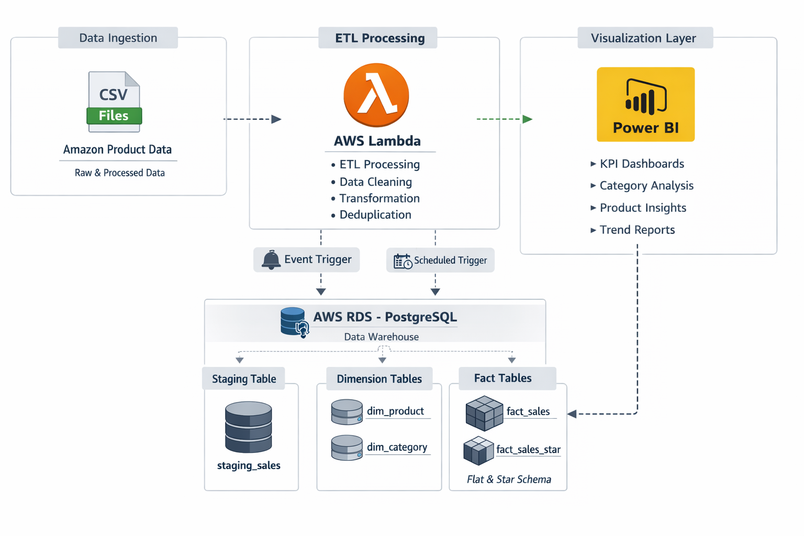

# Amazon Product Analytics — Cloud-Based Data Pipeline & BI Dashboard

---

## Overview

This project implements an end-to-end data analytics pipeline designed to transform raw e-commerce product data into structured, queryable, and insight-driven outputs. It integrates cloud storage, a relational database, and a business intelligence layer to simulate a production-grade analytics workflow.

---

## System Architecture

<p align="center">
  
  <br/>
  <em>Data Flow: Python Processing → AWS S3 Storage → AWS RDS PostgreSQL → Power BI Visualization</em>
</p>

---

## Architecture Description

The system follows a layered data pipeline:

* Data Processing Layer: Python scripts clean and transform unstructured product data
* Storage Layer: Processed datasets are stored in AWS S3
* Database Layer: Structured data is loaded into PostgreSQL hosted on AWS RDS
* Analytics Layer: Power BI connects to the database for modeling and visualization

This architecture ensures scalability, modularity, and separation of concerns.

---

## Technology Stack

| Layer           | Technology Used        |
| --------------- | ---------------------- |
| Data Processing | Python (Pandas, Regex) |
| Cloud Storage   | AWS S3                 |
| Database        | PostgreSQL (AWS RDS)   |
| Query Layer     | SQL                    |
| Visualization   | Power BI               |
| Data Modeling   | DAX                    |

---

## Data Pipeline Workflow

1. Raw product data is ingested from source files
2. Data cleaning and feature extraction are performed using Python
3. Cleaned data is uploaded to AWS S3
4. Data is loaded into PostgreSQL (AWS RDS)
5. Power BI connects to the database for reporting and analysis

---

## SQL Query Layer

Structured querying is performed on PostgreSQL (AWS RDS) to enable analytical reporting and efficient data retrieval.

### Key SQL Operations

* Data validation and filtering
* Aggregations for KPI computation
* Category-wise performance analysis
* Price and rating correlation queries

### Sample Queries

**1. Average Rating by Category**

```sql
SELECT category_L1, AVG(rating) AS avg_rating
FROM fact_sales
GROUP BY category_L1
ORDER BY avg_rating DESC;
```

**2. Top Rated Products**

```sql
SELECT product_name, rating, rating_count
FROM fact_sales
ORDER BY rating DESC, rating_count DESC
LIMIT 10;
```

**3. Discount Impact Analysis**

```sql
SELECT 
    category_L1,
    AVG(discount_percentage) AS avg_discount,
    AVG(rating) AS avg_rating
FROM fact_sales
GROUP BY category_L1;
```

**4. Price vs Rating Distribution**

```sql
SELECT 
    discounted_price,
    rating
FROM fact_sales;
```

These queries support downstream analytics and are integrated with Power BI for visualization.

---

## Dashboard Capabilities

### 1. Executive Overview

* Key performance indicators (average rating, discount percentage, total ratings, savings)
* Category-level performance comparison
* Rating distribution analysis

### 2. Product Exploration

* Detailed tabular view of products
* Filtering by category, brand, price, and rating
* Sorting and comparative analysis

### 3. Category Drill Analysis

* Hierarchical breakdown using category levels (L1–L5)
* Decomposition tree for multi-level insights
* Brand and product-type segmentation

---

## Data Modeling

* Central fact table (`fact_sales`) containing product-level metrics
* Derived attributes for hierarchical categories (category_L1 to category_L5)
* Measures implemented using DAX for dynamic aggregation and filtering

---

## Key Insights

* Products within moderate discount ranges show higher engagement and ratings
* Electronics and accessories dominate product distribution and interaction
* Pricing does not demonstrate a strong linear correlation with customer ratings

---

## Repository Structure

```
data/           Raw and processed datasets  
scripts/        Python data cleaning and transformation  
aws/            Cloud integration scripts (S3, RDS)  
sql/            SQL analysis queries  
dashboard/      Power BI report file (.pbix)  
images/         Dashboard screenshots and architecture diagram  
```

---

## Reproducibility

To replicate this project:

1. Execute Python scripts in `scripts/` to generate cleaned datasets
2. Upload processed data to AWS S3
3. Load data into PostgreSQL hosted on AWS RDS
4. Run SQL queries from `sql/analysis_queries.sql`
5. Open the Power BI file and connect to the database
6. Interact with the dashboard

---

## Future Enhancements

* Automated ETL pipeline using AWS Glue
* Scheduled data refresh using serverless workflows
* Real-time data ingestion
* Advanced analytics (forecasting and anomaly detection)

---

## Author

Rohit Birdawade
Data Analytics | Business Intelligence | Cloud Data Pipelines
